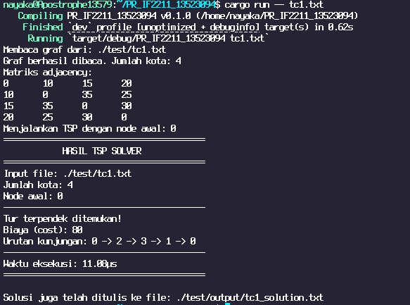
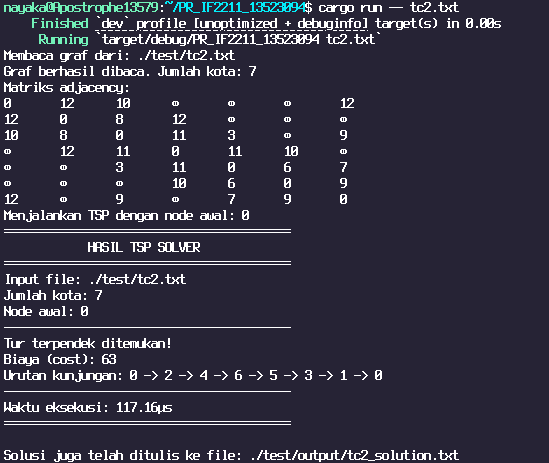

# Travelling Salesman Problem (TSP) Solver in Rust
[](https://github.com/nayakazna/PR_IF2211_13523094/blob/master/README.md)
[](https://github.com/nayakazna/PR_IF2211_13523094/blob/master/README.id.md)

> Ikon di atas menunjukkan bahasa yang digunakan dalam README ini dan dapat diklik untuk beralih ke versi bahasa yang sesuai.

## Deskripsi
Repositori ini berisi implementasi algoritma untuk menyelesaikan masalah Travelling Salesman Problem (TSP) menggunakan bahasa pemrograman Rust dengan pendekatan pemrograman dinamis (*dynamic programming*). TSP adalah masalah klasik di bidang keinformatikaan yang bertujuan menemukan rute terpendek yang mengunjungi setiap kota tepat satu kali dan kembali ke kota asal sehingga dapat kita terjemahkan sebagai persoalan optimasi kombinatorial. 
- Tiap kota dipandang sebagai simpul dalam graf, dan rute antar kota sebagai sisi dengan bobot yang mewakili jarak antar kota tersebut. 
- Dalam program ini, graf direpresentasikan sebagai matriks ketetanggaan (*adjacency matrix*), dengan setiap elemen matriks `dist[i][j]` menunjukkan jarak antara kota `i` dan kota `j`. 
- Program ini menggunakan pendekatan pemrograman dinamis untuk menghitung jarak terpendek yang diperlukan untuk mengunjungi semua kota, sedikit terinspirasi dari algoritma *Held-Karp*.

## Algoritma
Program ini menggunakan pemrograman dinamis untuk menyelesaikan TSP. Logika utama program menggunakan fungsi rekursif dengan memoisasi untuk menghitung jarak minimum yang diperlukan untuk mengunjungi semua kota. Jarak minimum dihitung dengan mempertimbangkan semua kemungkinan rute yang dapat diambil, dan hasilnya disimpan dalam tabel supaya tidak repot menghitung ulang rute yang sama.

## Konfigurasi
Input dari program ini, seperti tucil dan tubes pada mata kuliah ini, adalah berupa file `.txt` yang berisi matriks ketetanggaan. Format file input adalah sebagai berikut:

```
<jumlah_kota>
<matriks_ketetanggaan>
```

Contoh:

```
4
0 10 15 20
10 0 35 25
15 35 0 30
20 25 30 0
```

Konfigurasi `.txt` ini disimpan dalam direktori `test`.

## Kompilasi dan Eksekusi
0. Pastikan Rust sudah terinstal.
1. Clone repositori ini:
   ```bash
   git clone https://github.com/nayakazna/PR_IF2211_13523094.git
   ```
2. Masuk ke direktori utama:
   ```bash
    cd PR_IF2211_13523094
    ```
3. Compile dan jalankan program:
   ```bash
   cargo build
   cargo run -- <nama_file_input>.txt
   ```
4. Enjoy :D

## Contoh
Dengan file input `test/tc1.txt` yang berisi:

```
4
0 10 15 20
10 0 35 25
15 35 0 30
20 25 30 0
```
Program ini akan memberikan output:

```
Membaca graf dari: ./test/tc1.txt
Graf berhasil dibaca. Jumlah kota: 4
Menjalankan TSP dengan node awal: 0
=========================================
            HASIL TSP SOLVER             
=========================================
Input file: ./test/tc1.txt
Jumlah kota: 4
Node awal: 0
-----------------------------------------
Tur terpendek ditemukan!
Biaya (cost): 80
Urutan kunjungan: 0 -> 2 -> 3 -> 1 -> 0
-----------------------------------------
Waktu eksekusi: 17.95µs
=========================================
```

## Kasus Uji



## Pembuat
- Z. Nayaka Athadiansyah (13523094)