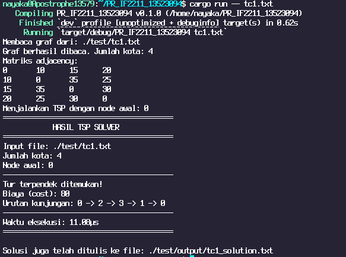
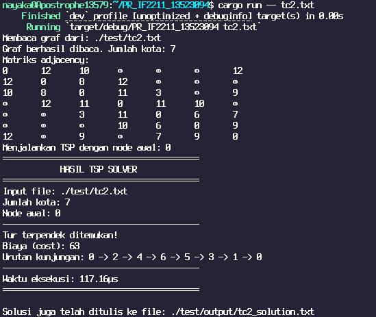

# Travelling Salesman Problem (TSP) Solver in Rust
[](https://github.com/nayakazna/PR_IF2211_13523094/blob/master/README.id.md)
[](https://github.com/nayakazna/PR_IF2211_13523094/blob/master/README.md)

> Ikon di atas menunjukkan bahasa yang digunakan dalam README ini dan dapat diklik untuk beralih ke versi bahasa yang sesuai.

## Description
This repository contains an implementation of an algorithm to solve the Travelling Salesman Problem (TSP) using the Rust programming language with a dynamic programming approach. TSP is a classic problem in computer science that aims to find the shortest route that visits each city exactly once and returns to the starting city, which can be translated as a combinatorial optimization problem.
- Each city is considered a node in a graph, and the routes between cities are edges with weights representing the distances between those cities.
- In this program, the graph is represented as an adjacency matrix, with each element `dist[i][j]` indicating the distance between city `i` and city `j`.
- Program ini menggunakan pendekatan pemrograman dinamis untuk menghitung jarak terpendek yang diperlukan untuk mengunjungi semua kota, sedikit terinspirasi dari algoritma *Held-Karp*.

## Algorithm
This program uses dynamic programming to solve TSP. The main logic of the program uses a recursive function with memoization to calculate the minimum distance required to visit all cities. The minimum distance is calculated by considering all possible routes that can be taken, and the results are stored in a table to avoid recalculating the same route.

## Configuration
The input for this program is a .txt file containing an adjacency matrix. The input file format is as follows:


```
<number_of_cities>
<adjacency_matrix>
```

Example:

```
4
0 10 15 20
10 0 35 25
15 35 0 30
20 25 30 0
```

This `.txt` configuration file should be placed in the `/test` directory.

## Compilation and Execution
To compile and run this program, ensure you have Rust installed on your system. Then, follow these steps:

1. Clone this repository:
   ```bash
   git clone https://github.com/nayakazna/PR_IF2211_13523094.git
   ```
2. Navigate to the project directory:
   ```bash
    cd PR_IF2211_13523094
    ```
3. Run the following command to compile and execute the program:
   ```bash
   cargo build
   cargo run -- <input_filename>.txt
   ```
4. Enjoy :D

## Example
Given the input file `test/tc1.txt` with the following content:

```
4
0 10 15 20
10 0 35 25
15 35 0 30
20 25 30 0
```
The program will give the output:

```
Membaca graf dari: ./test/tc1.txt
Graf berhasil dibaca. Jumlah kota: 4
Menjalankan TSP dengan node awal: 0
=========================================
            HASIL TSP SOLVER             
=========================================
Input file: ./test/tc1.txt
Jumlah kota: 4
Node awal: 0
-----------------------------------------
Tur terpendek ditemukan!
Biaya (cost): 80
Urutan kunjungan: 0 -> 2 -> 3 -> 1 -> 0
-----------------------------------------
Waktu eksekusi: 17.95µs
=========================================
```

## Test Cases



## Author
- Z. Nayaka Athadiansyah (13523094)